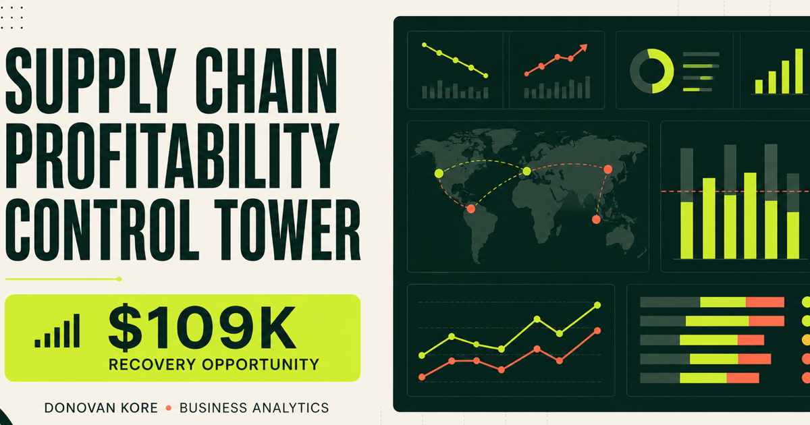

# Supply Chain Profitability Control Tower

An end-to-end Business Analytics portfolio project that connects operational service failures to financial impact. The solution moves beyond descriptive KPIs to answer a management question:

> Where is supply-chain performance eroding contribution margin, and which actions should leadership fund first?

**Live dashboard:** Add the deployed demo URL here after publishing  
**Author:** [Jean Michel Donovan Kore](https://www.linkedin.com/in/donovankore) · MS Business Analytics, 2026



## Executive outcome

The analysis identified a **$109K annualized recovery opportunity** across late-freight inefficiency and stockout exposure. The recommended action is a 60-day supplier recovery sprint focused on the lowest-performing suppliers, paired with revised reorder points for high-risk SKUs and weekly OTIF exception reviews.

| KPI | Result | Management interpretation |
|---|---:|---|
| Net revenue | $11.72M | Material commercial base for prioritization |
| Contribution margin | $4.01M / 34.2% | Healthy aggregate margin, with preventable leakage |
| On-time delivery | 92.9% | Below the 95% operating target |
| Stockout rate | 10.6% | Above the 8% target |
| Forecast accuracy | 88.3% | Supports targeted planning improvements |

## Why this project is recruiter-ready

- Frames a real executive decision instead of stopping at charts.
- Connects financial and operational metrics in one analytical model.
- Includes reproducible data generation, ETL, validation, SQL, tests, and a deployed decision interface.
- Documents assumptions and clearly discloses synthetic data.
- Demonstrates stakeholder communication through an executive brief and prioritized recommendation.

## Analytical workflow

```text
Synthetic order lines
        ↓
Python generation + controlled quality defects
        ↓
Validation, cleaning, feature engineering
        ↓
SQL business questions + KPI layer
        ↓
Interactive executive dashboard
        ↓
Recovery scenario + management recommendation
```

The deterministic generator produces 36,020 raw rows, including 20 duplicates, 30 missing supplier values, and 12 invalid freight values. The pipeline removes or resolves those defects and publishes 35,958 validated rows.

## Repository structure

```text
analytics/
  generate_data.py       # deterministic source-data generator
  run_pipeline.py        # cleaning, controls, KPIs, dashboard output
data/
  raw/                   # reproducible raw order lines
  processed/             # analysis-ready dataset
  dashboard.json         # aggregated dashboard model
sql/
  schema.sql             # analytical table and indexes
  business_questions.sql # executive, supplier, segment, opportunity queries
app/                     # interactive dashboard
tests/                   # Python data tests and rendered-site test
docs/                    # executive summary and LinkedIn launch copy
```

## Run the analysis

Requirements: Python 3.11+ and Node.js 22+.

```bash
python -m venv .venv
source .venv/bin/activate
pip install -r analytics/requirements.txt
python analytics/generate_data.py
python analytics/run_pipeline.py
python -m unittest tests/test_pipeline.py
```

## Run the dashboard

```bash
pnpm install
pnpm run dev
```

Open `http://localhost:3000` and use the year, region, and category filters. The recovery slider updates the modeled value opportunity.

## Metric definitions

- **Net revenue:** gross sales less the value of returned units.
- **Contribution margin:** net revenue less product cost and freight cost.
- **On-time delivery:** delivery date on or before the promised date.
- **Fill rate:** units retained after returns divided by ordered units; used here as a simplified service proxy.
- **Forecast accuracy:** `1 - weighted absolute percentage error` at the order-line level.
- **Stockout rate:** share of order lines with zero on-hand inventory at the modeled observation point.
- **Recovery opportunity:** 22% of freight spend on late lines plus 8% of revenue exposed to modeled stockouts.

## Data disclosure and limitations

The data is **synthetic and deterministic**. This choice makes the complete workflow safe to publish and easy to reproduce. It is not presented as a real company result. The $109K opportunity is an illustrative decision-support estimate, not a financial forecast. In production, the model would be calibrated with purchase orders, inventory snapshots, carrier invoices, service-level agreements, and lost-sales estimates.

## Tech stack

Python · pandas · SQL · TypeScript · React · Next-compatible vinext · CSS · automated tests

## Next production steps

1. Replace synthetic inputs with ERP, WMS, TMS, and finance sources.
2. Add semantic metric ownership and refresh monitoring.
3. Validate lost-sales and freight-recovery assumptions with Finance and Operations.
4. Add supplier drill-through, alerts, and role-based access.

---

If this analysis is relevant to your team, connect with me on [LinkedIn](https://www.linkedin.com/in/donovankore) or view my other work on [GitHub](https://github.com/donovankore).
